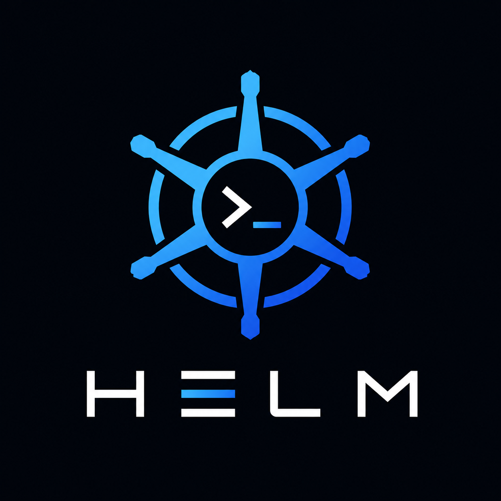

<p align="center">
  
</p>

<h1 align="center">HELM</h1>
<p align="center"><em>Take control of your development environment.</em></p>

<p align="center">
  <a href="https://github.com/n1th1n-19/HELM/releases/latest"></a>
  
  
  
</p>

---

HELM transforms any Android device into a dedicated developer command center — a sidecar display mounted beside your workstation showing real-time system monitoring, git insights, music controls, and active development environment status.

**Think:** Mission Control + Developer Dashboard + Stream Deck + System Monitor — built for developers.

---

## Install

```bash
curl -fsSL https://raw.githubusercontent.com/n1th1n-19/HELM/main/install.sh | bash
```

Installs the agent binary, sets up a systemd user service, configures ADB auto-reverse, and opens the firewall port for WiFi connectivity.

---

## Features

- **System monitoring** — CPU usage, RAM, temperature, network I/O, disk I/O, battery
- **Git insights** — branch, ahead/behind, working tree status, recent commits
- **Music controls** — MPRIS2 integration (Spotify, MPV, VLC, Firefox, any compatible player)
- **Active workspace** — VS Code workspace detection, current file, active window
- **Quick actions** — restart dev server, git pull/push, open terminal, lock screen
- **USB sidecar** — USB connection via ADB reverse tunnel (no Wi-Fi required)
- **WiFi sidecar** — Wireless connection with QR code pairing and mDNS auto-discovery
- **WiFi security** — TLS encryption + PSK token auth; cert pinning on Android (no CA required)
- **System tray** — right-click menu: connection status, stop, restart
- **Local-first** — no cloud, no accounts, no telemetry
- **Kiosk mode** — fullscreen, landscape lock, keep screen on, boot autostart

---

## Architecture

```
┌─────────────────────┐     WebSocket      ┌──────────────────────┐
│   Android Device    │◄──────────────────►│  Desktop Agent       │
│   (Kotlin/Compose)  │  ws://localhost     │  (Rust/Tokio)        │
│                     │      :9090  (USB)   │                      │
│  • 7-tab dashboard  │  wss://LAN_IP:9090 │  • System metrics    │
│  • Responsive UI    │  + TLS + PSK token  │  • Git collector     │
│  • USB + WiFi conn  │       (WiFi)        │  • MPRIS2 music      │
│  • QR pairing       │  adb reverse        │  • VS Code workspace │
│  • mDNS discovery   │  tcp:9090 tcp:9090  │  • Window detection  │
│  • Kiosk mode       │  (auto-maintained)  │  • Command executor  │
└─────────────────────┘                     └──────────────────────┘
```

The desktop agent collects system data and pushes delta updates to the Android client over WebSocket. USB mode is zero-config plaintext (loopback-safe). WiFi mode uses TLS + PSK token auth — the QR code carries the cert fingerprint and token for one-scan pairing.

---

## Requirements

**Workstation:**
- Linux (KDE/X11 recommended for full feature set; Wayland degrades gracefully)
- ADB installed

**Android device:**
- Android 10+ (API 29+)
- Phone, tablet, or foldable

**Optional for full feature set:**
- `xdotool` — active window detection (X11)
- `playerctl` / MPRIS2-compatible players — music controls
- `fuser` — dev server restart
- VS Code or VSCodium

---

## Quick Start

### Option A — Install script (recommended)

```bash
curl -fsSL https://raw.githubusercontent.com/n1th1n-19/HELM/main/install.sh | bash
```

This installs the agent, creates a systemd service, and handles ADB and firewall setup automatically.

### Option B — Manual build

```bash
# Build the agent
cd agent && cargo build --release
./target/release/helm run
```

### Connect Android

**USB (zero-config):**
```bash
# Plug in your Android device — ADB reverse is maintained automatically
# Install the app
adb install android/app/build/outputs/apk/debug/app-debug.apk
```

**WiFi:**
1. Set `bind_host = "0.0.0.0"` in `~/.config/helm/agent.toml`
2. Restart agent — a `helms://` QR code prints in the terminal (includes cert fingerprint + PSK token)
3. Open HELM on Android → Settings tab → Scan QR → connection is automatically TLS-secured

---

## CLI

```
helm [COMMAND]

Commands:
  run      Start the agent (default)
  status   Show running status and address
  stop     Stop the running agent
  restart  Stop then start
  qr       Print WiFi pairing QR code
  config   Print current configuration
```

---

## Configuration

`~/.config/helm/agent.toml` (created with defaults on first run):

```toml
# USB mode (default) — only accept local connections via ADB reverse
bind_host = "127.0.0.1"
port = 9090

# WiFi mode — accept connections from any LAN device
# bind_host = "0.0.0.0"

# mDNS advertisement for auto-discovery (WiFi mode only)
mdns_enabled = true

# Commands the Android app is allowed to trigger
allowed_commands = [
    "git_pull",
    "git_push",
    "lock",
    # "open_terminal",
    # "open_project",
    # "restart_dev_server",
    # "suspend",
    # "reboot",
    # "shutdown",
]

[poll_intervals]
cpu_ms         = 1000
memory_ms      = 2000
network_ms     = 1000
disk_ms        = 2000
temperature_ms = 2000
battery_ms     = 30000
process_ms     = 3000
window_ms      = 500
```

---

## Protocol

HELM uses a WebSocket-based delta protocol. On connect, the agent sends a full state snapshot. After that, only changed fields are transmitted. See [`protocol/README.md`](protocol/README.md) for the full message schema.

---

## Project Structure

```
helm/
├── android/          # Android app (Kotlin, Jetpack Compose, Material 3)
├── agent/            # Desktop agent (Rust, Tokio, WebSocket)
├── protocol/         # WebSocket message schema (JSON Schema)
├── docs/             # Architecture and setup documentation
├── assets/           # Logo and brand assets
├── plugins/          # Plugin system (V2, coming soon)
└── install.sh        # One-liner installer
```

---

## Performance Targets

| Target | Goal |
|--------|------|
| Android RAM | < 100 MB |
| Android CPU | < 5% |
| Android FPS | 60 |
| Agent RAM | < 20 MB |
| Agent CPU at idle | ~0% |

---

## Roadmap

- [ ] Album art display in media screen
- [ ] Wayland active window support (wlr-foreign-toplevel / KDE DBus)
- [ ] Plugin system (Docker, Kubernetes, GitHub, GitLab, Ollama, Claude Code)
- [ ] macOS agent support

---

## Uninstall

```bash
bash uninstall.sh
```

Or:

```bash
curl -fsSL https://raw.githubusercontent.com/n1th1n-19/HELM/main/uninstall.sh | bash
```

Stops the service, removes the binary, config dir (certs, token, `agent.toml`), systemd unit, udev rule, and firewall rule.

---

## Contributing

See [CONTRIBUTING.md](CONTRIBUTING.md).

## License

MIT — see [LICENSE](LICENSE)
